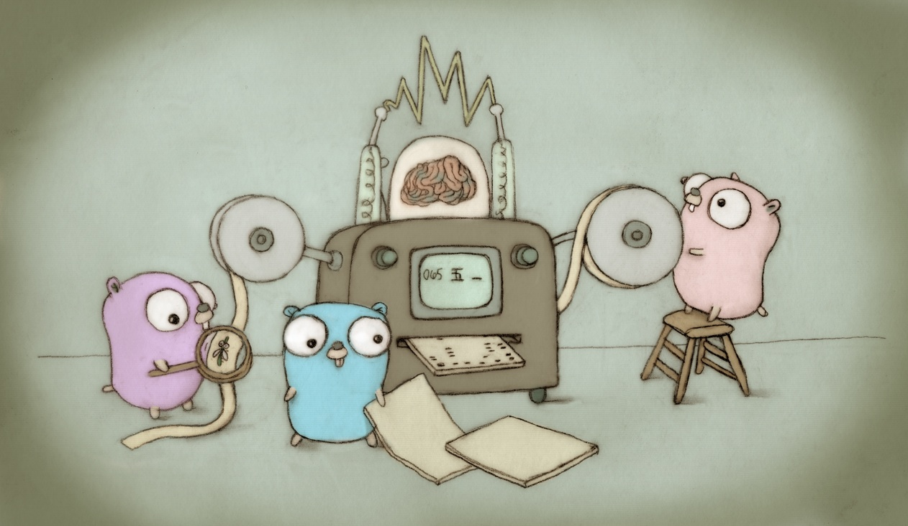

# Go Assessment by DISQO

## Go Documentation:

## Required Dependencies:
* Golang **version 1.18**
* Make & Bash
* Docker & Docker-compose
* Mac / Darwin or Linux Operating System

## Run Instructions:
* cd **build** folder and run **make setup**
  * This will spin up the database for you.
  * This command will also wait until you connection is established.
    * Soon as we get a connection, it will create the table **badass_users** for you.
    * You can connect to it easily by using a mysql client:
      * **mysql -u root -ppassword -h0.0.0.0 -P1444 badass_db**
      * then run: **SHOW TABLES;**
      * then run: **DESCRIBE badass_users;**
* finally run **make run** to build then spin up the go microservice.
  * You can optionally run **make build** and **make up** separately. Run performs build then up in that respective order.
    * **make build** will build your microservice.
    * **make up** will run your microservice from your last build.
    * **you can also build this for linux if you're not using a mac**
      * Just add the argument **os=linux** i.e. **make run os=linux**

## Connecting to the database:
* Check **config/cluster/go-assessment-dev** for connection details
* Application is configured to run on port 8080

## Application Demo Instructions:
* You can test the health-check endpoint by running **curl -i 0.0.0.0:8080/health-check**
* If you have time, please fill this portion out.

## Other Notes:
* Standard Go Directory Structure: https://github.com/golang-standards/project-layout
